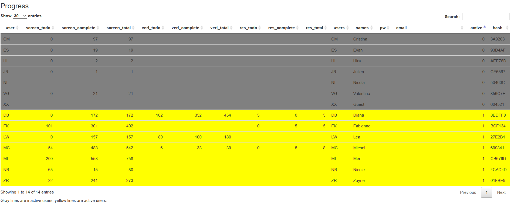
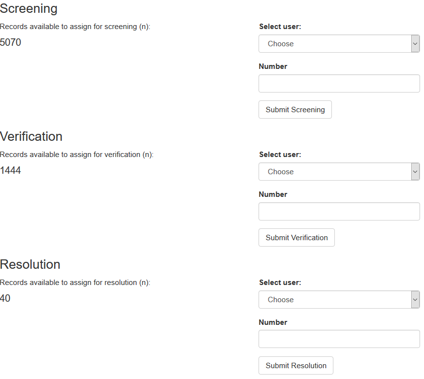
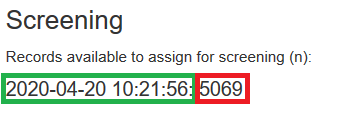

# Workload manager [version 20.04.2020]

The workload manager is a password protected enviroment to manage the crowd. An overview of the users and their status is provided in a table:

## Elements

Assignment can be performed using the forms below the progress table:

The number of available records for each action are displayed. Assignment is performed by selecting the users initials and entering a number. This is submitted and the script checks the number of available records for this action for this user. It communicates the decision with the server, and the progress table and the number available are updated when succesful. 

## Logs

The workload manager logs all incoming communication with the server (REDCap report: Assignment) as time stamped csv files. Allowing to (manually) roll-back any decisions.
