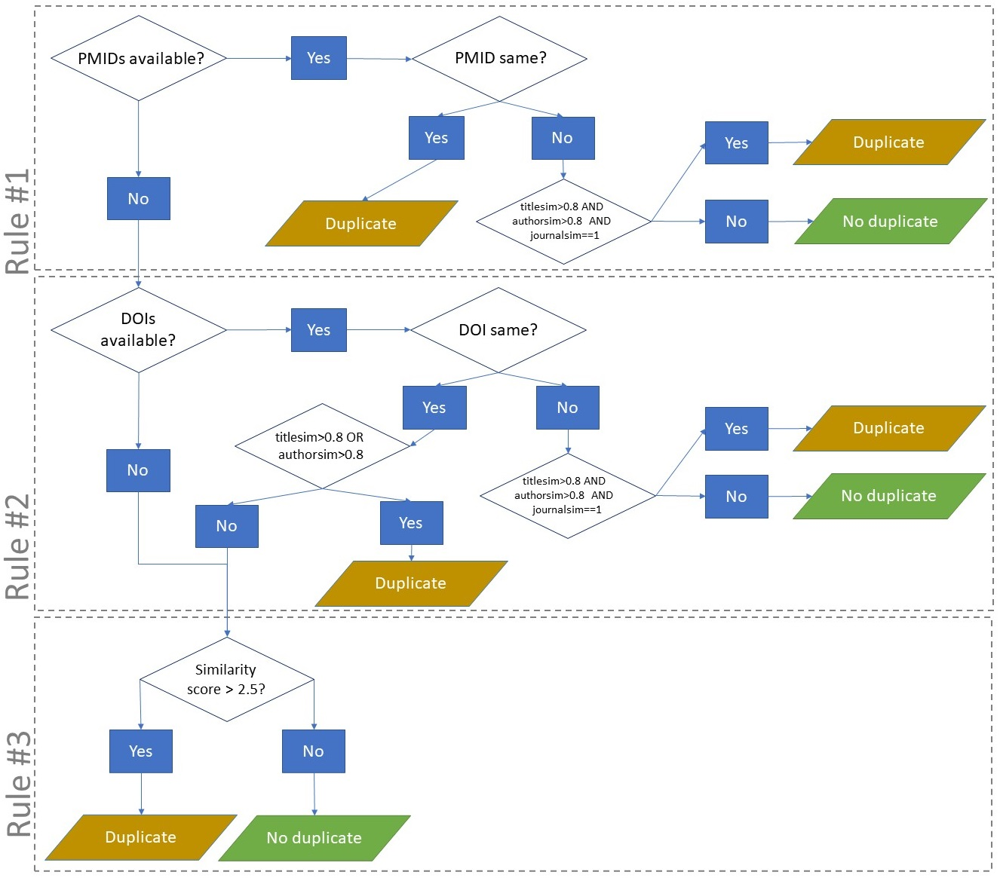

index: [[**HOME**](index.html)] [[**Collecting data**](collectingdata.html)] [**Deduplication**] [[**Screening**](screening.html)]

# Deduplication of bibliographic records

We perform rule-based deduplication based on methods described [Jiang et al. (2014)](https://academic.oup.com/database/article/doi/10.1093/database/bat086/2633762) and [Bramer et al. (2016)](https://www.ncbi.nlm.nih.gov/pmc/articles/PMC4915647/).

Additionally, we calculate score of similarity based on different algorithms (figure). This combination of rules and scores allows an efficient and accurate deduplication.

These scores are used to predict the duplication status (duplicate/unique) of a know dataset. Thus, we need test data where duplicates are detected as a 'gold standard'. 

# Comparison of different methods 

## Test data (gold standard)

We prepared test data to evaluate the deduplication algorithm. Our ‘gold-standard’ set consisted of 2450 records, 1220 from Embase and 1230 from MEDLINE. Of the Embase records, 901/1220 had a or PMID; 859/1220 were identical to the MEDLINE set. 2391/2450 (97.6%) of the records had a DOI; fifty-nine did not. We identified 1075 duplicate pairs, which we considered ‘true’ duplicates. 2006 records were duplicates of at least one other record, 444 were unique records. Within MEDLINE, there were 13 duplicates, within EMBASE 44. The remaining 1018 records were duplicates between the two databases.

## Performance

| Algorithm        | True positives | False positives | False negatives |
|------------------|----------------|-----------------|-----------------|
| Bramer           | 1025/1075      | 52              | 39/1075         |
| Score-based      | 1067/1075      | 23              | 8/1075          |
| Blended (1,2,3)  | 1071/1075      | 12              | 4/1075          |
| Blended (2,1,3)  | 1073/1075      | 9               | 2/1075          |

