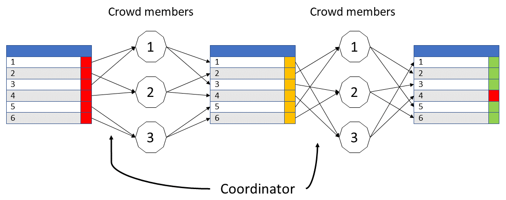

index: [[**HOME**](index.html)] [[**Collecting data**](collectingdata.html)] [[**Deduplication**](deduplication.html)] [**Screening**]

# Screening and annotation of citations
When unique records are entered into the database, they are ready to be screening on eligibility and to be classified.

## Purpose of the screening
* Allows other research groups to start with a curated dataset
* Serves as training set (machine learning, classification)
* Allows us to track the accumulation of evidence over time (similar to [Counotte et al.](https://www.medrxiv.org/content/10.1101/2020.03.16.20036806v1))
* Preselection according to inclusion criteria

## Work distribution: using a 'crowd'
To be able to distribute screening tasks to a 'crowd', we build a shiny app that communicates with the central database. Records are attibuted to members of the crowd for screening. When the task is completed, the decisions are verified by a second member of the crowd. Disagreement is resolved by the coordinator or by a third crowd member (Figure 1).

**Figure 1. The workflow of screening and verification tasks. Crowd members are represented by numbered hexagons.**

The [screening app](screening_app_manual/index.html) offers a login-protected environment that communicates with the central database. Crowd members are presented with citation information and are asked to make several decisions. Their decisions are submitted to the database.