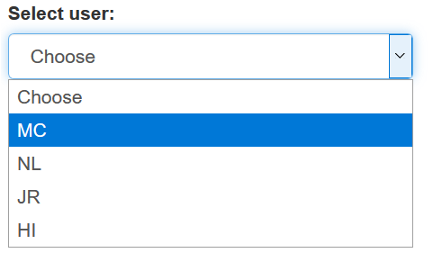
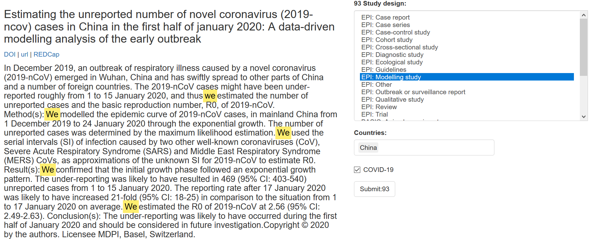

# How to use the screening app

## Login
To be able to login, you should have been provided a username (initials) and a code. Your username should be available in the drop-down menu:

1. Select the user:

2. Enter your code:

If your login is successful, the response text will display 'login success:TRUE'. 
 
## Screening

If the login is successful, a list of maximum 50 citations is shown. The title and, if available, abstract are shown. Three links allow you to see more details: DOI, url and REDCap. You might not have REDCap access. 

On the right, three questions about the paper need to be filled out: (1) the study design, (2) the country/countries, (3) whether the publication is indeed on COVID-19/Sars-CoV-2.

Country information may be omitted for basic research studies.

Fill out the three items, and click on the submit button.

That's it. Your decision has been submitted to the REDCap server, and the server response is shown on the top of the page:

 
 
If you have hard time answering the questions, or you feel information is missing (paper in a language you don't understand, or where google translate is not making any sense), you can click the 'IDONTKNOW' button:

This marks the item incomplete and flags it up for discussion. Try to avoid using this option.

# FAQ

## How is information saved?
As soon as you click a submit button, the information is sent to REDCap. The response text on the top of the page confirms that the communication with the server was successful. 

## Can I exit the application without saving?
Yes. Since every decision is directly submitted to the server, there is no need to save information when exiting the webpage.

## There is no abstract for a certain records?
This happens a lot. Sometimes because there are no abstracts available and sometimes because the database (EMBASE, PubMed, ...) did not return the abstract correctly. Browse to the original location of the publication using the DOI or url button to find more information. 

## How do we keep track of progress?
REDCap keeps track of all the changes. We can see the progress using the REDCap dashboard or dedicated reporting function:

## Where is the UNDO button?
At the moment is there none. If you think you made a mistake, scroll to the top of the screening page and copy the response text, and send me an email. 

## I don't know what to do?!?!
OK. that happens. Records might be incomplete, or you might not feel confident in making a decision. Use the checkbox 'IDONTKNOW'. We will resolve the issue.

## I get a message that there is no data?
It could happen that you get a message like the one below, telling you that there is no data. This means you have finished all your tasks and new tasks have not been assigned yet. Congratulations on completing your work!

